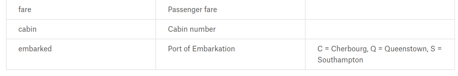

# Report 2 - Titanic

The sinking of the [RMS Titanic](https://en.wikipedia.org/wiki/RMS_Titanic) is one of the most infamous shipwrecks in history.  On April 15, 1912, during her maiden voyage, the Titanic sank after colliding with an iceberg, killing 1502 out of 2224 passengers and crew. This sensational tragedy shocked the international community and led to better safety regulations for ships.

One of the reasons that the shipwreck led to such loss of life was that there were not enough lifeboats for the passengers and crew. Although there was some element of luck involved in surviving the sinking, some groups of people were more likely to survive than others, such as women, children, and the upper-class.

In this challenge, we ask you to complete **the analysis of what sorts of people were likely to survive**. In particular, we ask you to apply the tools of machine learning to predict which passengers survived the tragedy.

[
RMS泰坦尼克号](https://en.wikipedia.org/wiki/RMS_Titanic)的沉没是历史上最臭名昭著的海难之一。于1912年4月15日，在其处女航期间，泰坦尼克号与冰山相撞后沉没，造成2224名乘客和机组人员中的1502人丧生。这场轰动的悲剧震惊了国际社会，并促使了更为严格的船舶安全法规。

导致如此多生命丧失的原因之一是乘客和机组人员的救生艇不足。尽管在沉没中生还涉及一些幸运因素，但某些人群比其他人更有可能生存，如妇女、儿童和上层阶级。

在这个挑战中，我们请您完成对**哪些人更有可能生存的分析**。具体而言，我们要求您运用机器学习的工具来预测哪些乘客在这场悲剧中幸存。

## Practice Skills

* Binary classification
* Python & SKLearn

## Data

The data ziped into `data.zip`, please first extract it. There are two groups:

* training set (train.csv)
* test set (test.csv)

The training set should be used to build your machine learning models. For the training set, we provide the outcome (also known as the `ground truth`) for each passenger. Your model will be based on `features` like passengers' gender and class. You can also use feature engineering to create new features.

The test set should be used to see how well your model performs on unseen data. For the test set, we do not provide the ground truth for each passenger. It is your job to predict these outcomes. For each passenger in the test set, use the model you trained to predict whether or not they survived the sinking of the Titanic.

We also include `gender_submission.csv`, a set of predictions that assume all and only female passengers survive, as an example of what a submission file should look like.

训练集应该用于构建您的机器学习模型。对于训练集，我们提供了每位乘客的结果（也称为`ground truth`）。您的模型将基于像乘客性别和舱位等`features`。您还可以使用特征工程来创建新的特征。

测试集应该用于查看您的模型在未见过的数据上的表现如何。对于测试集，我们不提供每位乘客的`ground truth`。您的任务是预测这些结果。对于测试集中的每位乘客，请使用您训练的模型预测他们是否在泰坦尼克号沉没中幸存。

我们还包含了`gender_submission.csv`，其中包含了一组预测，假设所有女性乘客都幸存，作为提交文件的示例。这展示了提交文件应该是什么样子。

### Data description

### Variable Notes

`pclass`: A proxy for socio-economic status (SES)

社会经济地位

* 1st = Upper
* 2nd = Middle
* 3rd = Lower

## Requirements

* Design the classification model, implement the code
* Think methods to resolve the problem of missing data of some column
* How to convert the `pclass`, `embarked` fields to vector field
* Submit your result to [the website](https://www.kaggle.com/c/titanic) (如果不能访问这个网站，则想办法如何*科-*-学=上网)
* Finish the report by using the template `report_template.ipynb`
* Submit code, report through `git`

## Links

* [Titanic: Machine Learning from Disaster](https://www.kaggle.com/c/titanic)
