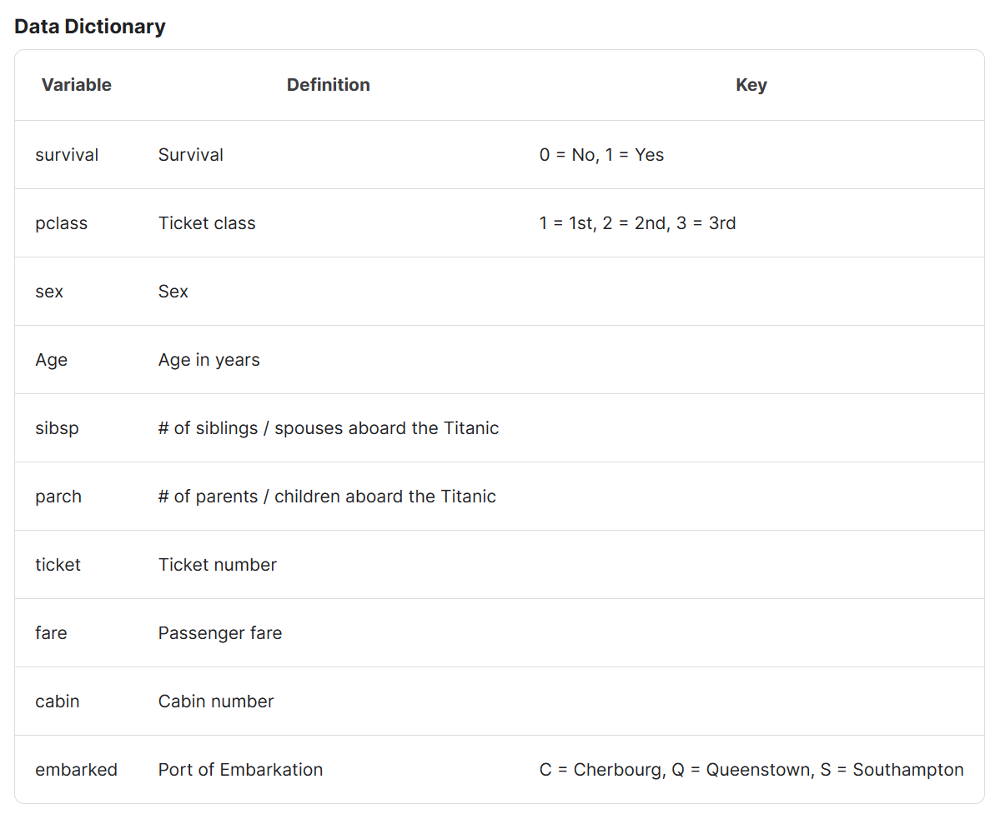

# Report 2 - Titanic

[RMS泰坦尼克号](https://en.wikipedia.org/wiki/RMS_Titanic)的沉没是历史上最臭名昭著的海难之一。完成对**哪些人更有可能生存的分析**，本质是二分类问题，难点在于数据缺失值的处理。

### Ⅰ. 数据

数据分为：

* 训练数据：`train.csv`，共有891条数据
* 测试数据：`test.csv`，共有418条数据


数据文件为`csv`格式的文本文件，可以使用 `pandas`库读取，具体的数据格式如下图所列：



train数据共有12列

test数据共有11列， 比train少了survival列

每列含义：

1. **PassengerId（乘客ID）:** 乘客在数据集中的唯一标识。
2. **Survived（是否幸存）:** 目标变量，表示乘客是否在泰坦尼克号沉没事件中幸存。1表示幸存，0表示未幸存。
3. **Pclass（舱位等级）:** 乘客所在的舱位等级，有三个值：1st（上层）、2nd（中层）、3rd（下层）。
4. **Name（姓名）:** 乘客的姓名。
5. **Sex（性别）:** 乘客的性别，值为 "male"（男性）或 "female"（女性）。
6. **Age（年龄）:** 乘客的年龄。可能包含缺失值。
7. **SibSp（同辈亲属数量）:** 乘客在船上有多少兄弟姐妹或配偶。
8. **Parch（非同辈亲属数量）:** 乘客在船上有多少父母或子女。
9. **Ticket（船票号码）:** 乘客的船票号码。
10. **Fare（票价）:** 乘客支付的船票费用。
11. **Cabin（客舱号码）:** 乘客的客舱号码。可能包含缺失值。
12. **Embarked（登船港口）:** 乘客登船的港口，有三个值：C（瑟堡）、Q（皇后镇）、S（南安普顿）。可能包含缺失值。


### Ⅱ. 步骤

#### 1. 数据读取

使用pandas

#### 2. 数据校验

查看是否有缺失值、异常值，并进行填充、修正

```python
print(train_data.info())
print('-' * 30)
print(test_data.info())
```


可见train数据集中Age列和Cabin列大量缺失，Embarked少量缺失

test数据集中Cabin列大量缺失，Fare列少量缺失

**缺失值的处理：**

- 对于 `Age` 列：由于缺失值较多，因此不能直接删除缺失列，使用其他特征预测年龄。
- 对于 `Cabin` 列：由于缺失值较多，而且该特征较分散、随机。可以考虑将缺失和非缺失分为两个类别，或者在分析中不使用这一列。我选择分为缺失、非缺失两个类别。
- 对于 `Embarked` 列：由于缺失值较少，考虑使用众数填充。
- 对于 `Fare` 列：可以使用均值或中位数填充缺失值。

处理缺失值之后：


#### 2. 数据编码

针对非数值型数据。

* 映射为唯一的整数。可以使用`sklearn.processing.LabelEncoder()`,每个不同的类别都被映射为一个唯一的整数值。但是，`LabelEncoder` 会在对具有大小关系的类别进行编码时引入错误的大小关系

* 映射为独热码。若某些非数值数据具有大小关系，如"small"、"big"，此时应该使用One-Hot Encoding


#### 3. 归一化(可选)

（针对连续型的数值型数据），可以使用`sklearn.processing.MinMaxScaler`


处理前后的数据：


#### 4. 划分数据集

```python
X_train,X_test,Y_train,Y_test= train_test_split(X,Y,test_size=0.1, random_state=0)
```


#### 5. 训练，拟合

比如使用随机森林回归模型，可以使用GridSearchCV选择最优参数

搜索过程比较慢，可以调整搜索的范围和步长，还可以并行搜索，添加参数`n_jobs=8`

```python
grid = GridSearchCV(rf, param_grid, cv=2, verbose=2, n_jobs=<num_threads>)   # 这一步的作用是选择最优参数, 但是这里的cv=3是3折交叉验证, n_jobs是并行数
```

最佳参数：


#### 6. 打印评价指标
