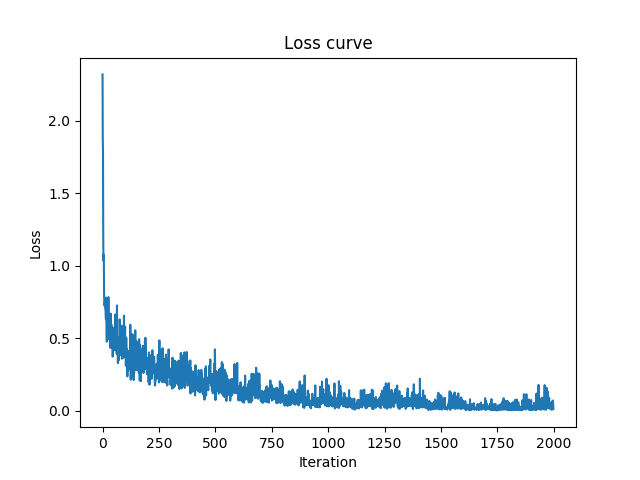

# Report3 - 服装分类

FashionMNIST 是一个替代 [MNIST 手写数字集](https://link.zhihu.com/?target=http%3A//yann.lecun.com/exdb/mnist/)的图像数据集。

数据来源：[fashion-mnist](https://github.com/zalandoresearch/fashion-mnist)

 它是由 Zalando（一家德国的时尚科技公司）旗下的研究部门提供。其涵盖了来自 10 种类别的共 7 万个不同商品的正面图片。

FashionMNIST 的大小、格式和训练集/测试集划分与原始的 MNIST 完全一致。60000/10000 的训练测试数据划分，28x28 的灰度图片。

以下是Fashion-MNIST数据集中的类别标签：

1. T-shirt/top（T恤/上衣）
2. Trouser（裤子）
3. Pullover（套头衫）
4. Dress（裙子）
5. Coat（外套）
6. Sandal（凉鞋）
7. Shirt（衬衫）
8. Sneaker（运动鞋）
9. Bag（包）
10. Ankle boot（踝靴）


## 步骤：

#### 读取numpy格式的数据集

使用`np.load`

如果是读取csv文件，则使用`pd.read_csv`


#### 继承Dataset数据集

继承torch.utils.data.Dataset类，用于处理自己所使用的数据集，此处是fashion-mnist

需要定义`__init__`, `__len__`, `__getitem`方法

- `__init__`：可以在这里设置加载的data和label, 可以是numpy/tensor
- `__Len__`：获取数据集大小
- `__getitem__`：根据索引获取一条训练的数据和标签

```python
class FashionMNISTDataset(Dataset):
    def __init__(self, images, labels, transform=None):
        # 定义的CNN模型的输入为(batch_size, 1, 28, 28)
        # images的shape为torch.Size([bachsize, 784]), labels的shape为torch.Size([bachsize])
        # 需要将images的shape转换为torch.Size([bachsize, 1, 28, 28])
        self.images = images.reshape(-1, 1, 28, 28) # -1表示该维度由其他维度推断得到
        self.labels = labels
        self.transform = transform

    def __len__(self):
        return len(self.images)
    
    def __getitem__(self, idx): # idx为索引, 该方法用于获取数据集中的数据和标签
        image = self.images[idx]
        label = self.labels[idx]
        if self.transform:
            image = self.transform(image)
        return image, label
```


#### 定义数据集

使用上一步继承Dataset类得到的新类进行实例化

```python
train_dataset = FashionMNISTDataset(train_images, train_labels)
test_dataset = FashionMNISTDataset(test_images, test_labels)
```


#### 定义数据集加载器

使用torch.utils.data.Dataset类进行实例化

```python
train_loader = DataLoader(dataset=train_dataset, batch_size=batch_size, shuffle=True)
test_loader = DataLoader(dataset=test_dataset, batch_size=batch_size, shuffle=False)
```


#### 定义网络模型

网络模型定义在`model.py`文件：

继承`torch.nn.Module` 类，两个重要方法是 `__init__` 和 `forward`

* `__init__` 方法用于初始化模型的结构和参数。定义了模型的各个层、参数等结构，并将它们实例化。

* `forward` 方法定义了模型的前向传播逻辑，使用`__init__`中定义的网络层。当调用模型实例并传递输入数据时，PyTorch 会自动调用 `forward` 方法来执行前向传播。


网络结构：

包含三层卷积层，卷积层使用批量归一化，两层池化层，两层全连接层

输入为(batchsize, 1, 28, 28)，输出为(batchsize, 10)

```python
# 定义网络模型, 用于MNIST分类
class CNN_model(nn.Module):
    # __init__方法是类的构造函数，用于初始化类的成员
    # forward方法定义了数据流向，即数据如何在网络层间传递
    # forward使用__init__中定义的网络层
    def __init__(self):
        super(CNN_model, self).__init__() # 调用父类的构造函数
        # 三层卷积层，卷积层使用批量归一化，两层池化层，两层全连接层
        self.layer1 = nn.Sequential(
            nn.Conv2d(in_channels=1, out_channels=16, kernel_size=(3, 3), stride=(1, 1), padding=(1, 1)),   # （bachsize, 1, 28, 28）->（bachsize, 16, 28, 28）
            # in_channels为输入的通道数, in_channels=1因为fashion-mnist的图片是灰度图，只有一个通道
            # out_channels为卷积核的数量, kernel_size为卷积核的大小, stride为步长, padding为填充, padding=(kernel_size-1)/2
            # stride=(1, 1)表示水平和竖直方向的步长都为1，padding=(1, 1)表示在水平和竖直方向都填充1个像素
            # padding=(input_size - kernel_size + 2*padding)/stride + 1, 这样卷积后的输出大小和输入大小相同(28*28)
            # 卷积核的大小一般为奇数，这样才能保证padding为整数
            nn.BatchNorm2d(num_features=16),    # (bachsize, 16, 28, 28) -> (bachsize, 16, 28, 28)
            nn.ReLU(),  # （bachsize, 16, 28, 28）->（bachsize, 16, 28, 28）
            nn.MaxPool2d(kernel_size=(2, 2), stride=(2, 2))   # （bachsize, 16, 28, 28）->（bachsize, 16, 14, 14）
        )

        self.layer2 = nn.Sequential(
            nn.Conv2d(in_channels=16, out_channels=32, kernel_size=(3, 3), stride=(1, 1), padding=(1, 1)),  # （bachsize, 16, 14, 14）->（bachsize, 32, 14, 14）
            nn.BatchNorm2d(num_features=32),    # （bachsize, 32, 14, 14）->（bachsize, 32, 14, 14）
            nn.ReLU(),  # （bachsize, 32, 14, 14）->（bachsize, 32, 14, 14）
            nn.MaxPool2d(kernel_size=(2, 2), stride=(2, 2))  # （bachsize, 32, 14, 14）->（bachsize, 32, 7, 7）
        )

        self.layer3 = nn.Sequential(
            nn.Conv2d(in_channels=32, out_channels=64, kernel_size=(3, 3), stride=(1, 1), padding=(1, 1)),  # （bachsize, 32, 7, 7）->（bachsize, 64, 7, 7）
            nn.BatchNorm2d(num_features=64),    # （bachsize, 64, 7, 7）->（bachsize, 64, 7, 7）
            nn.ReLU()   # （bachsize, 64, 7, 7）->（bachsize, 64, 7, 7）
        )

        self.fc1 = nn.Linear(in_features=64*7*7, out_features=128)  # （bachsize, 64*7*7）->（bachsize, 128）
        self.fc2 = nn.Linear(in_features=128, out_features=10)  # （bachsize, 128）->（bachsize, 10）

    def forward(self, x):   # 定义数据流向，即数据如何在网络层间传递
        x = self.layer1(x)
        x = self.layer2(x)
        x = self.layer3(x)
        x = x.view(x.size(0), -1)   # 因为全连接层的输入是一维的，所以需要将卷积层的输出拉平
        x = self.fc1(x)
        x = self.fc2(x)
        return x
```


网络模型实例化：

```python
model = CNN_model().to(device)    # 将模型加载到device中，即加载到GPU或CPU中
```


#### 定义损失函数和优化器

```python
criterion = nn.CrossEntropyLoss()   # 交叉熵损失函数
optimizer = torch.optim.Adam(model.parameters(), lr=learning_rate)    # Adam优化器
```


#### 训练

```python
def train():
    total_step = len(train_loader)  # 计算每个epoch的batch数量
    for epoch in range(num_epochs):
        for i, (images, labels) in enumerate(train_loader): # 用enumerate()函数将train_loader转换成索引-数据对
            images = images.float().to(device)  # 将数据加载到device中
            labels = labels.long().to(device)  # 将数据加载到device中
            # print("images.shape: ", images.shape)
            # print("labels.shape: ", labels.shape)

            # 前向传播
            outputs = model(images) # outputs的shape为(batch_size, 10)
            loss = criterion(outputs, labels)
            loss_list.append(loss.item())
            # print("loss: ", loss.item())

            # 反向传播和优化
            optimizer.zero_grad()   # 将梯度归零
            loss.backward() # 反向传播计算梯度
            optimizer.step()    # 更新参数

            if (i+1) % 10 == 0:    # 每1个batch打印一次日志
                print('Epoch [{}/{}], Step [{}/{}], Loss: {:.4f}'
                    .format(epoch+1, num_epochs, i+1, total_step, loss.item()))

    # 保存模型
    if not os.path.exists('./model'):  # 如果./model文件夹不存在，则创建
        os.makedirs('./model')
    torch.save(model.state_dict(), './model/model.ckpt')   # 保存模型参数

    # 保存loss曲线图片
    plt.plot(loss_list)
    plt.xlabel('Iteration')
    plt.ylabel('Loss')
    plt.title('Loss curve')
    plt.savefig('./images/loss.png')
    plt.show()
```


#### 测试

```python
# 测试模型
def test():
    model.load_state_dict(torch.load('./model/model.ckpt'))   # 加载模型参数
    model.eval()    # 将模型设置为评估模式，即计算过程中不要dropout和batch normalization
    with torch.no_grad():   # 不计算梯度
        correct = 0
        total = 0
        for images, labels in test_loader:
            images = images.float().to(device)  # 将数据加载到device中
            labels = labels.long().to(device)  # 将数据加载到device中
            outputs = model(images)
            _, predicted = torch.max(outputs.data, dim=1) # 取得分最高的那个类
            total += labels.size(0) # labels.size(0)为batch_size
            correct += (predicted == labels).sum().item()   # 记录正确的个数
        print('Accuracy of the network on the 10000 test images: {} %'.format(100 * correct / total))
```


#### 训练结果



#### 测试结果


#### 推理inference.py

该文件首先处理单张图片，将其处理成能都匹配model的输入，能输出该图片的分类结果和每个类别的概率。


#### 训练与推理的关系

假设batchsize为100，channel数为1，训练时会将输入变为(100, 1, 28, 28)，输出为(100, 10)，即输出中的行对应于一个样本，列对应于模型对每个类别的预测。

在推理时，在处理单张图像时，要将其形状从 `(1, 28, 28)` 调整为 `(1, 1, 28, 28)` ，将其看作是批次大小为1的批处理，因此需要在第一维度上添加批次维度。这是为了保持模型接受输入数据的一致性。

在绝大多数深度学习框架（如PyTorch和TensorFlow）中，模型的输入形状是 `(batch_size, channels, height, width)`。即使只有一张图像，也需要通过添加批次维度来匹配模型的输入要求。模型仍然能够正确处理这样调整后的输入。


### 错误记录

错误一：

模型的权重是`FloatTensor`类型，但输入数据是`LongTensor`类型

```python
# 训练模型
def train():
    total_step = len(train_loader)  # 计算总共有多少个batch
    for epoch in range(num_epochs):
        for i, (images, labels) in enumerate(train_loader): # 用enumerate()函数将train_loader转换成索引-数据对
            images = images.to(device)  # 将数据加载到device中
            labels = labels.to(device)  # 将数据加载到device中

            print("images.shape: ", images.shape)
            print("labels.shape: ", labels.shape)

            # 前向传播
            outputs = model(images) # outputs的shape为(batch_size, 10)
            loss = criterion(outputs, labels)

            # 反向传播和优化
            optimizer.zero_grad()   # 将梯度归零
            loss.backward() # 反向传播计算梯度
            optimizer.step()    # 更新参数

            if (i+1) % 100 == 0:    # 每100个batch打印一次日志
                print('Epoch [{}/{}], Step [{}/{}], Loss: {:.4f}'
                    .format(epoch+1, num_epochs, i+1, total_step, loss.item()))
    
    # 保存模型
    if not os.path.exists('./model'):  # 如果./model文件夹不存在，则创建
        os.makedirs('./model')
    torch.save(model.state_dict(), './model/model.ckpt')   # 保存模型参数
```

在输入image时加上`.float()`，修正后的代码：

```python
# 训练模型
def train():
    total_step = len(train_loader)  # 计算总共有多少个batch
    for epoch in range(num_epochs):
        for i, (images, labels) in enumerate(train_loader): # 用enumerate()函数将train_loader转换成索引-数据对
            images = images.float().to(device)  # 将数据加载到device中
            labels = labels.to(device)  # 将数据加载到device中

            print("images.shape: ", images.shape)
            print("labels.shape: ", labels.shape)

            # 前向传播
            outputs = model(images) # outputs的shape为(batch_size, 10)
            loss = criterion(outputs, labels)

            # 反向传播和优化
            optimizer.zero_grad()   # 将梯度归零
            loss.backward() # 反向传播计算梯度
            optimizer.step()    # 更新参数

            if (i+1) % 100 == 0:    # 每100个batch打印一次日志
                print('Epoch [{}/{}], Step [{}/{}], Loss: {:.4f}'
                    .format(epoch+1, num_epochs, i+1, total_step, loss.item()))
    
    # 保存模型
    if not os.path.exists('./model'):  # 如果./model文件夹不存在，则创建
        os.makedirs('./model')
    torch.save(model.state_dict(), './model/model.ckpt')   # 保存模型参数
```


错误：

```
遇到的错误涉及到模型预测（outputs）和目标标签（labels）在计算损失时的数据类型不匹配。CrossEntropyLoss 期望目标标签的数据类型为 torch.long，但似乎 labels 变量的数据类型为 torch.ByteTensor。

你可以通过在使用标签进行损失计算之前将其显式转换为正确的数据类型来解决此问题。你可以使用 .long() 方法执行此转换。
```

解决：

```python
labels = labels.long().to(device)
```


