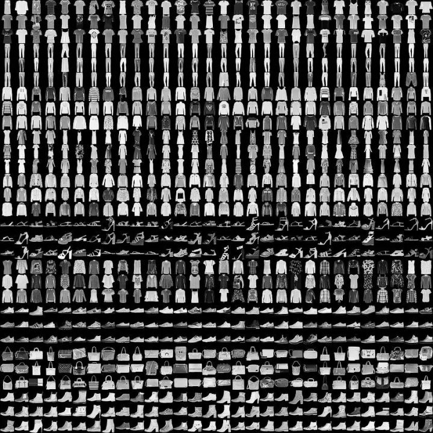

# Report3 - 服装分类

FashionMNIST 是一个替代 [MNIST 手写数字集](https://link.zhihu.com/?target=http%3A//yann.lecun.com/exdb/mnist/)的图像数据集。

数据来源：[fashion-mnist](https://github.com/zalandoresearch/fashion-mnist)

 它是由 Zalando（一家德国的时尚科技公司）旗下的研究部门提供。其涵盖了来自 10 种类别的共 7 万个不同商品的正面图片。

FashionMNIST 的大小、格式和训练集/测试集划分与原始的 MNIST 完全一致。60000/10000 的训练测试数据划分，28x28 的灰度图片。你可以直接用它来测试你的机器学习和深度学习算法性能，**且不需要改动任何的代码**。

这个数据集的样子大致如下（每个类别占三行）：

以下是Fashion-MNIST数据集中的类别标签：

1. T-shirt/top（T恤/上衣）
2. Trouser（裤子）
3. Pullover（套头衫）
4. Dress（裙子）
5. Coat（外套）
6. Sandal（凉鞋）
7. Shirt（衬衫）
8. Sneaker（运动鞋）
9. Bag（包）
10. Ankle boot（踝靴）

## 步骤：

#### 1. 读取数据

.npy文件，用`np.load()`读取

.csv文件，用`pd.read_csv`读取
