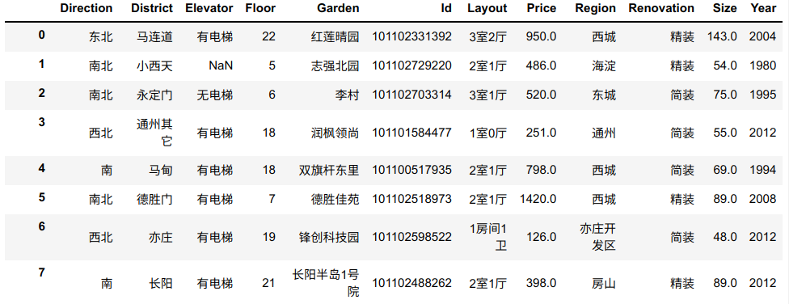
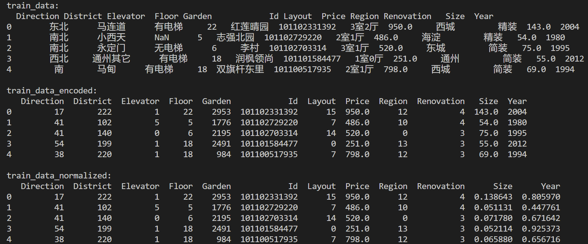

### 房价预测（回归问题）

房屋的价格和所在区域、楼层、房龄等都有密切的关系，现在需求开发一个房价预测的模型，通过训练数据拟合得到房屋的价格


### Ⅰ. 数据

数据分为：

* 训练数据：`train_data.csv`，共有16573条数据
* 测试数据：`test_data.csv`，共有7104条数据


数据文件为`csv`格式的文本文件，可以使用 `pandas`库读取，具体的数据格式如下图所列：



数据共有12列，分别是：

* `Direction`： 房屋所在城市的方位
* `District`： 区域
* `Elevator`：是否有电梯
* `Floor`： 所在楼层
* `Garden`： 小区名字
* `Id`: 唯一的编号
* `Layout`：几室，几厅
* `Price`： 价格 （需要预测的值）
* `Region`： 所在的区域
* `Renovation`： 房屋装修的类型
* `Size`：房屋面积
* `Year`：建成年份


### Ⅱ. 步骤

#### 1. 数据读取

使用pandas

#### 2. 数据编码

针对非数值型数据。

* 映射为唯一的整数。可以使用`sklearn.processing.LabelEncoder()`,每个不同的类别都被映射为一个唯一的整数值。但是，`LabelEncoder` 会在对具有大小关系的类别进行编码时引入错误的大小关系

* 映射为独热码。若某些非数值数据具有大小关系，如"small"、"big"，此时应该使用One-Hot Encoding


#### 3. 归一化(可选)

（针对连续型的数值型数据），可以使用`sklearn.processing.MinMaxScaler`


处理前后的数据：




#### 4. 划分数据集

```python
X_train,X_test,Y_train,Y_test= train_test_split(X,Y,test_size=0.1, random_state=0)
```


#### 5. 训练，拟合

比如使用随机森林回归模型，可以使用GridSearchCV选择最优参数


#### 6. 打印评价指标

回归问题的评价指标有平均绝对误差、均方误差、R2得分、解释方差得分等等。

```python
from sklearn.metrics import mean_absolute_error, mean_squared_error, r2_score, explained_variance_score
```

